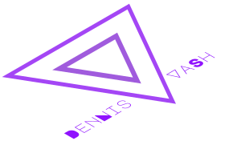
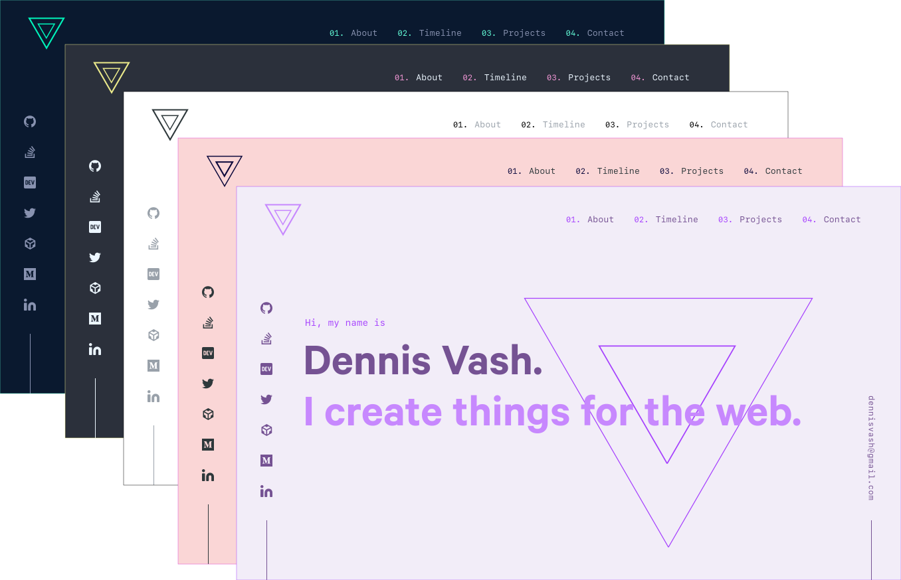

<h1 align="center">



[](https://app.netlify.com/sites/dennisvash/deploys) [](https://app.netlify.com/sites/dennisvash-storybook/deploys)  [](https://www.codacy.com/manual/denvash/dennisvash.com?utm_source=github.com&utm_medium=referral&utm_content=denvash/dennisvash.com&utm_campaign=Badge_Grade)

</h1>

## [Storybook Deployment](https://dennisvash-storybook.netlify.com/?path=/story/*)

> ⚠️ Site still Under construction 🚧

## Features

  

- [Atomic Design Methodology](https://bradfrost.com/blog/post/atomic-web-design/)
- [Storybook UI Development](https://storybook.js.org/)
- Static site empowered with [Gatsby](https://www.gatsbyjs.org/)
- Hosted by [Netlify](https://www.gatsbyjs.org/docs/deploying-to-netlify)
- Themeable with [`styled-component`](https://www.styled-components.com/) & [`polished`](https://polished.js.org/)
- Markdown Content quired with [GraphQL](https://graphql.org/).

## Installation

1. Clone and install packages

   ```sh
   git clone https://github.com/denvash/dennisvash.com.git
   cd dennisvash.com/
   yarn install
   ```

2. [Generate Github Token](https://help.github.com/articles/creating-a-personal-access-token-for-the-command-line/) and add it as an environment variable

   ```.env
   <!-- .env -->
   GITHUB_TOKEN=fxav8f2a**
   ```

3. Development

   ```sh
   yarn develop
   yarn storybook
   ```

## Building and Running for Production

1. Generate a full static production build

   ```sh
   yarn build
   ```

2. Preview the site as it will appear once deployed

   ```sh
   yarn serve
   ```
